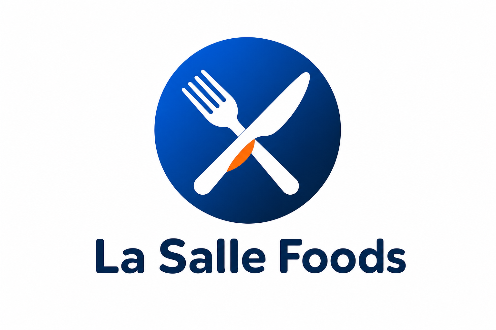
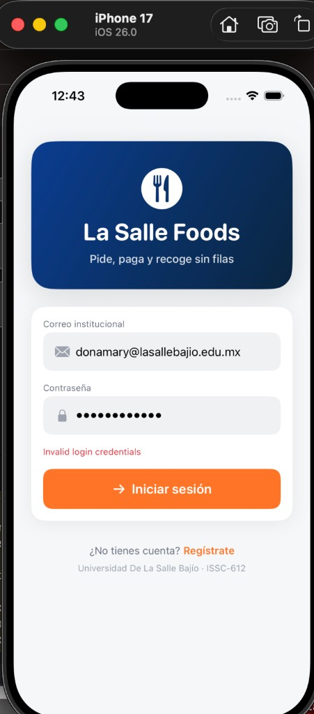
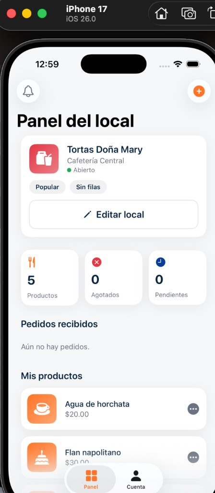

<div align="center">



# La Salle Foods
### Documentación del Proyecto Final — SwiftUI

**Universidad De La Salle Bajío · ISSC-612**
Aplicación de gestión móvil (iOS) — Giro: pedidos y recolección en cafeterías universitarias

**Fecha de entrega:** 17 de junio de 2026
**Repositorio:** https://github.com/dxvm0n/La-Salle-Foods

</div>

---

## 1. Equipo

| Integrante | Rol |
|---|---|
| _(completar)_ | Desarrollo iOS / Backend |
| _(completar)_ | Desarrollo / Documentación |

---

## 2. Descripción de la problemática

En las cafeterías y locales de comida dentro del campus universitario, el proceso de pedido
y pago se realiza **de forma manual y presencial**: los estudiantes hacen fila, piden de viva
voz, esperan a que se prepare su orden y pagan en caja. Esto provoca:

- **Filas largas y pérdida de tiempo** en los horarios pico (entre clases), justo cuando el
  tiempo libre del alumno es más corto.
- **Errores en la toma de pedidos** (órdenes mal anotadas, confusión de nombres).
- **Falta de visibilidad** para el dueño del local sobre la demanda, los productos más
  pedidos y el estado de cada orden.
- **Sin registro digital** de ventas ni de la operación diaria.

> *"Actualmente, las cafeterías del campus gestionan sus pedidos de forma manual y presencial,
> lo que provoca filas, errores en el registro y falta de datos en tiempo real. El objetivo de
> este proyecto es digitalizar y automatizar el proceso de pedido y recolección para reducir
> errores, eliminar filas y dar al dueño control y visibilidad sobre su operación."*

---

## 3. Propuesta de solución y justificación del giro

**La Salle Foods** es una aplicación móvil iOS que digitaliza el flujo completo de pedido y
recolección ("pide, paga y recoge sin filas") para las cafeterías del campus, con dos roles:

- **Alumno:** explora locales y menús, arma su pedido, elige método de pago y recibe un
  **folio** y un **código de recogida**; sigue el estado de su orden en tiempo real y recibe
  avisos cuando está lista.
- **Dueño del local:** administra su local y catálogo (alta/edición/baja de productos),
  recibe los pedidos y avanza su estado (pendiente → preparando → listo → completado).

**Justificación del giro:** es un proceso administrativo real, acotado y verificable, que
ejercita todos los conceptos clave de SwiftUI (navegación, componentes, estado, formularios)
y se apoya en un backend propio (API REST en Java + MySQL) con autenticación, autorización y
lógica de negocio — cumpliendo de lleno los requerimientos de la rúbrica.

### Objetivos
- Eliminar filas mediante pedidos anticipados con código de recogida.
- Reducir errores tomando precios y datos siempre desde el servidor.
- Dar al dueño una herramienta de gestión (catálogo, pedidos, estados, avisos).
- Restringir el acceso a la comunidad institucional (`@lasallebajio.edu.mx`).

---

## 4. Arquitectura técnica

```
┌────────────────────┐   HTTPS / JSON   ┌──────────────────────────┐   JDBC   ┌──────────────┐
│   App iOS (SwiftUI) │ ───────────────▶ │  API REST Java (Servlets) │ ───────▶ │   MySQL 8    │
│  APIClient/Keychain │ ◀─────────────── │   Tomcat 10.1 · Azure     │ ◀─────── │  (12 tablas) │
└────────────────────┘                  └──────────────────────────┘          └──────────────┘
        Cliente                          Azure Container Apps            Azure Database for MySQL
```

- **Frontend:** SwiftUI (iOS 26). Manejo de estado con `@State`/`ObservableObject`
  (`SessionStore`, `CatalogStore`, `OrderStore`). Tokens en Keychain.
- **Backend:** API REST en **Java (Servlets, Jakarta EE 6, Tomcat 10.1)**. Autenticación
  propia con **BCrypt + JWT (HS256)**, autorización por rol y lógica de negocio (pedidos,
  estados, notificaciones) en Java. Acceso a datos con JDBC + pool HikariCP.
- **Base de datos:** **MySQL 8** con **12 tablas** (usuarios, perfiles, tokens, categorías,
  etiquetas, restaurantes, productos, pedidos, líneas de pedido, notificaciones…).
- **Despliegue en la nube:** **Microsoft Azure** — imagen Docker en Azure Container Registry,
  ejecución en **Azure Container Apps** y **Azure Database for MySQL Flexible Server**.

**URL del backend desplegado:**
`https://lasallefoods-backend.whiteforest-7f031d41.westus2.azurecontainerapps.io/api`
(health: `/api/health` → `{"database":"up","status":"ok"}`)

---

## 5. Cumplimiento de requerimientos técnicos (SwiftUI)

| Requerimiento | Cumplimiento |
|---|---|
| **Navegación jerárquica, ≥6 vistas** (`NavigationStack`/`TabView`) | Inicio, Menú del local, Carrito, Pedidos, Notificaciones, Cuenta, Panel del local + pantallas de detalle |
| **Detalle desde lista + flujo modal** | Detalle de pedido / producto; hojas modales (formularios de producto y de local) |
| **≥3 componentes reutilizables** | `AppButton`, `LabeledInput`, `TagChip`, `SymbolThumbnail`, `FilterChip`, `StatCard`, `EmptyStateView`, `RestaurantCard`… |
| **Text, Image + ≥4 controles** | `Text`, `Image`, `TextField`, `Button`, `Toggle`, `Picker`/chips de selección |
| **VStack + HStack + ZStack** | Layouts combinados en todas las vistas |
| **List / ScrollView** | `ScrollView` y listas en todas las pantallas |
| **`@State`** | Estado local en formularios (texto, toggles, selección) |
| **API REST remota** | API Java + MySQL en Azure; config local con `@AppStorage` |

### Formularios con operaciones CRUD (mínimo 6)

| # | Formulario | Operación |
|---|---|---|
| 1 | Registro de cuenta | **Create** usuario/perfil (+ local si es dueño) |
| 2 | Producto (alta/edición) | **Create / Update / Delete** producto |
| 3 | Editar local + etiquetas | **Update** restaurante y etiquetas |
| 4 | Datos personales | **Update** perfil (nombre) |
| 5 | Carrito / pedido | **Create** pedido |
| 6 | Gestión de pedido | **Update** estado / cancelar |

---

## 6. Prototipos / capturas de la aplicación

<div align="center">

| Inicio de sesión | Panel del local (dueño) |
|---|---|
|  |  |

</div>

*El maquetado inicial se realizó en Figma; estas capturas corresponden a la implementación
final en el simulador (iPhone 17, iOS 26).*

---

## 7. Guía de estilo

### 7.1 Logotipo
Ícono de tenedor y cuchillo dentro de un círculo con degradado azul institucional y un acento
naranja, acompañado del wordmark "La Salle Foods" en tipografía redondeada.

### 7.2 Paleta de colores

| Token | Hex | Uso |
|---|---|---|
| Azul institucional | `#0B3D91` | Navegación activa, marca |
| Azul marino | `#0A2540` | Títulos y texto principal |
| Naranja principal | `#FF7426` | Botones CTA, agregar/confirmar |
| Naranja cálido | `#FFA34D` | Degradados, banners |
| Éxito (verde) | `#1FAA59` | Pedido confirmado, indicadores positivos |
| Peligro (rojo) | `#E23744` | Acciones destructivas / agotado |
| Calificación | `#FFC107` | Estrellas / ratings |
| Fondo | `#F6F7F9` | Fondo general |
| Superficie | `#FFFFFF` | Tarjetas y formularios |
| Texto secundario | `#6B7280` | Subtítulos y descripciones |
| Borde | `#E5E7EB` | Separadores |

### 7.3 Tipografía (SF Rounded / system)

| Estilo | Tamaño / Peso |
|---|---|
| Large Title | 32 · Bold (rounded) |
| Title | 24 · Bold (rounded) |
| Headline | 18 · Semibold (rounded) |
| Body | 16 · Regular |
| Callout | 15 · Medium |
| Subheadline | 14 · Regular |
| Caption | 12 · Regular |
| Precio | 16 · Bold (rounded) |

### 7.4 Espaciado y radios

- **Espaciado (pt):** 4 · 8 · 12 · 16 · 24 · 32 · 48
- **Radios de esquina (pt):** 8 · 12 · 18 · 28 · pill (999)
- **Sombras:** tarjeta (negro 6%, radio 12) y flotante (negro 12%, radio 18)

---

## 8. Cuentas de prueba

Contraseña para ambas: `LaSalle2026!`

| Rol | Correo |
|---|---|
| Dueño | `donamary@lasallebajio.edu.mx` |
| Alumno | `alumno@lasallebajio.edu.mx` |

> El registro de nuevas cuentas solo acepta correos del dominio `@lasallebajio.edu.mx`.

---

## 9. Cómo ejecutar

**App iOS:** abrir `LaSalleFoods.xcodeproj` en Xcode y ejecutar (Cmd+R). La app consume el
backend desplegado en Azure por defecto.

**Backend (local, opcional):** `cd backend && docker compose up --build`
(API en `http://localhost:8080/api`). Ver `backend/README.md` para detalles y despliegue en Azure.

---

## 10. Enlaces

- **Repositorio:** https://github.com/dxvm0n/La-Salle-Foods
- **Backend (nube):** https://lasallefoods-backend.whiteforest-7f031d41.westus2.azurecontainerapps.io/api
